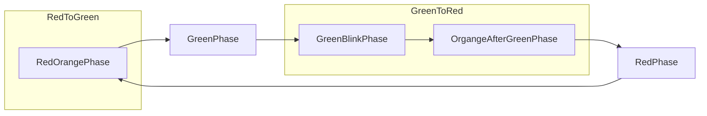

# Werkstättenprotokoll `06.11`

| Titel | Daten                                        |
|---------|----------------------------------------------|
| Einheit | `06.11`                                      |
| Inhaltsübersicht | Ampellicht nach öster. Ampelsteuerung schalten |
| Stunden (Einheiten) | `7`                                          |
| Fachlehrer | `Martin GIMPL`                               |
| Werkstätte | `EMC`                                        |

# Inhalt

1. **Ampelschaltung**
   - Ziel: Eine funktionierende Ampelschaltung nach österreichischen Anforderungen
   - Umsetzung
     1. Schaltplan erstellen mit easyEDA (Protokoll 23.10 [siehe hier](einheit-23.10.md))
     2. Schaltung berechnen
     3. Prototypen mit der Hilfe des Steckbretts schaltplangetreu aufbauen
     4. Mikrocontroller (ESP32) programmieren

# Protokoll

## Ampelschaltung

Ziel der Ampelschaltung war es, eine Ampelschaltung umzusetzen, welche nach den österreichischen Anforderungen schaltet.

### Schaltplan

Dies ist bereits im Protokoll vom 23.10 zufinden. Es kann [hier](einheit-23.10.md) geöffnet werden.

### Berechnung

Da die Lampe bereits einen Innenwiderstand verbaut hat, ist dieser Punkt überfällig.

### Programmierung

Wir nutzten wir `switch case`. Diese Funktion hat folgenden Syntax:

```c++
switch(expression) {
  case x:
    // code block
    break;
  case y:
    // code block
    break;
  default:
    // code block
}
```

Die `expression` ist mit `enum` (~ Enumeration) definiert:

```c++
enum Level {
  LOW,
  MEDIUM,
  HIGH
};
```


`enum` ~ Enumeration ist eine Gruppe von konstanten Variablen. Dabei steht wie im oben Beispiel beschrieben `LOW` für `0`, `MEDIUM` für `1` und `HIGH` für `2`.


Die Ampelschaltung wurde mit dem zuvor besprochen Wissen umgesetzt:

```c++
enum Trafficlights
{
  RedPhase,
  RedOrangePhase,
  GreenPhase,
  GreenBlinkPhase,
  OrgangeAfterGreenPhase,
  UndefinedState,
  pedestrianGreen,
  pedestrianRed,
  pedestrianStart
};

uint8_t Trafficlights = RedPhase; // Die Variable Trafficlights mit der Enumeration RedPhase deklarieren

void loop()
{
  switch (Trafficlights)
  {
  case RedPhase:
    digitalWrite(RED_BULB, HIGH);
    digitalWrite(GREEN_BULB, LOW);
    digitalWrite(YELLOW_BULB, LOW);
    delay(FIXED_STATE_TIME);
    Trafficlights = RedOrangePhase;
    break;
  case RedOrangePhase:
    digitalWrite(RED_BULB, HIGH);
    digitalWrite(YELLOW_BULB, HIGH);
    digitalWrite(GREEN_BULB, LOW);
    delay(SWITCH_STATE_TIME);
    Trafficlights = GreenPhase;
    break;
  case GreenPhase:
    digitalWrite(RED_BULB, LOW);
    digitalWrite(YELLOW_BULB, LOW);
    digitalWrite(GREEN_BULB, HIGH);
    delay(FIXED_STATE_TIME);
    Trafficlights = GreenBlinkPhase;
    break;
  case GreenBlinkPhase:
    digitalWrite(RED_BULB, LOW);
    digitalWrite(YELLOW_BULB, LOW);
    for (int i = 0; i < 4; i++)
    {
      digitalWrite(GREEN_BULB, LOW);
      delay(BLINK_TIME);
      digitalWrite(GREEN_BULB, HIGH);
      delay(BLINK_TIME);
    }
    Trafficlights = OrgangeAfterGreenPhase;
    break;
  case OrgangeAfterGreenPhase:
    digitalWrite(RED_BULB, LOW);
    digitalWrite(GREEN_BULB, LOW);
    digitalWrite(YELLOW_BULB, HIGH);
    delay(SWITCH_STATE_TIME);
    digitalWrite(YELLOW_BULB, LOW);
    Trafficlights = RedPhase;
    break;
  case UndefinedState:
    while (true)
    {
      digitalWrite(YELLOW_BULB, LOW);
      delay(BLINK_TIME);
      digitalWrite(YELLOW_BULB, HIGH);
      delay(BLINK_TIME);
    }
  }
}
```


`uint8_t` ist ein unsigned Int (eine Integer-Variable mit 32-Bit Speicher Verbrauch -> kann von 0 bis $2^{32}$ also 4294967295 speichern) welche auf 8-Bit Speicher Verbrauch beschränkt ist. Daher kann sie $2^8$ also von 0 bis 255 (256 Werte) speichern.


## Code Architektur

Der Code kann über folgenden Flowchart dargestellt werden:



# Code

Der gesamte Code befindet sich auf Github und kann unter [diesem Link](https://github.com/mrschwaig/HTL-Bulme_Werkstatt_GIM) geöffnet werden.